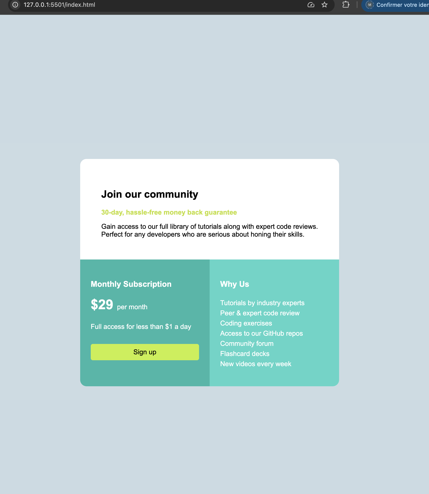

## EXERCICE3_P1_SINGLE_PRICE_GRID

cet exercice  m'a permis de réaliser mon tout premier projet en language HTML et CSS grâce à quelques bases que j'ai; à des recherches et à l'aide de mes paires (CS4).

 ce projet est une implémentation d'un composant de grille de tarification simple et responsive. Concu pour s'entraîner à structurer du HTML et styliser avec du CSS.

la partie qui à été un plus compliquer lors de la réalisation, etait la responsivité (CSS) qui neccissite de faire adapter la page à tous les ecrans!

## Capture d'ecran:

## LIEN:

[Démo](https://asmah003.github.io/single-price-grid/)

